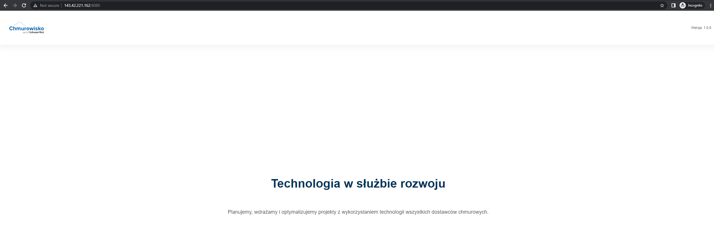

<br><br>
<br><br>
<br><br>

# Rollout

## LAB Overview

In this lab you will create an application Deployment. Then you'll update it, examine its history and do the rollback.

## Task 1: Create a Deployment

1. Open the [manifest file](./files/deployment.yaml) and check its contents.
2. Create new Deployment by running:

    ```bash
    kubectl apply -f deployment.yaml
    ```

3. Check if Deployment is created and Pods are running:

    ```bash
    kubectl get deployment
    ```

    ```bash
    kubectl get pods
    ```

## Task 2: Expose Deployment via service

1. Expose a deployemnt via LoadBalanver service on port 8080:

    ```bash
    kubectl expose deployment rollout --type=LoadBalancer --port=8080 --name=rollout
    ```

2. Visit web page via Web Browser and check the version number.
    
    


## Task 3: Examine the deployment

1. Verify details of the Deployment

   ```bash
   kubectl describe deployment rollout
   ```

2. Check if each Pod belonging to current rollout has `pod-template-hash` label

    ```bash
    kubectl get pods --show-labels
    ```

## Task 4: Update the Deployment

1. To update the container image of the Deployment run the following command:

    ```bash
    kubectl set image --record deployment/rollout app=macborowy/workshop-rollout:2.0.0
    ```

2. Check if all Pods in Deployment are `READY`, `UP-TO-DATE` and `AVAILABLE`:

    ```bash
    kubectl get deployment
    ```

3. Verify if new Pods were created:

    ```bash
    kubectl get pods --show-labels
    ```

4. Visit the same page and check the version number.

## 5. Update application version by modifing Deployment manifest

1. Open the manifest file by running:

    ```bash
    nano deployment.yaml
    ```

2. Edit the following properties of the Deployment:

   - set replicas to: 5
   - set image to: `macborowy/workshop-rollout:3.0.0`

   To Deployment's `metadata` add new annotation:

   ```bash
   annotations:
      kubernetes.io/change-cause: "Image changed to 3.0.0"
   ```

   If you're not quite sure how to update manifest file, use [updated-deployment.yaml](./files/updated-deployment.yaml) file.

3. Update the Deployment by running: 

    ```bash
    kubectl apply -f <manifest-file>
    ```

    After a while you'll have 5 Pods with version `3.0.0` running managed by your Deployment.

    

4. Visit the same page and check the version number.

## Task 6: Managing Rollout History

1. Get the history of the Deployment by running:

    ```bash
    kubectl rollout history deployment rollout
    ```
    
    

2. If you are interested in more details about a particular revision, you can add the **--revision** flag to view details about that specific revision:

    ```bash
    kubectl rollout history deployment rollout --revision=2
    ```

    

3. Undo the last rollout by running:

    ```bash
    kubectl rollout undo deployments rollout
    ```

4. Check the history of Deployments

    ```bash
    kubectl rollout history deployment rollout
    ```

    

    As you notices, there is no longer Deployment 2, and Deployment 4 was added. Now we have revisions 1,3 and 4.

5. Check if application is actually rolled-back by visiting the same page and check the version number.

6. Rollback to revision 3 by running

    ```bash
    kubectl rollout undo deployments rollout --to-revision=3
    ```

    and check the history: 

    ```bash
    kubectl rollout history deployment rollout
    ```

    The application should be now back in version `3.0.0`.

    

## Task 7: Delete the Deployment

1. Please delete the Deployment:

    ```bash
    kubectl delete deployment rollout
    ```

## END LAB

<center><p>&copy; 2023 Chmurowisko Sp. z o.o.<p></center>
