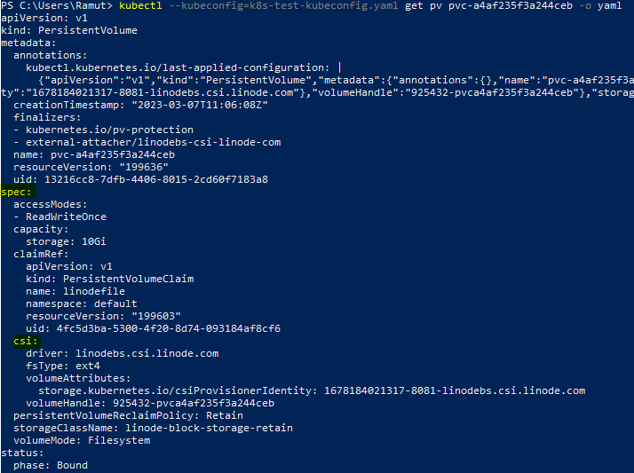
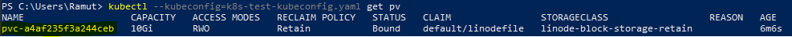
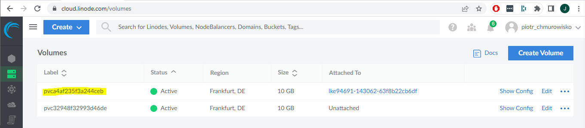
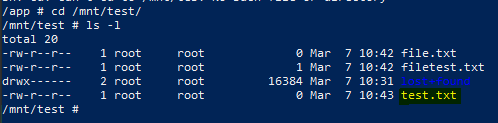

<br><br>
<br><br>
<br><br>

# Storage

---

## Task 1: Create a pvc and mount to the applications
1. A list of available StorageClass

   ```bash
   kubectl get sc
   ```

1. Print StorageClass details

   ```bash
   kubectl describe sc linode-block-storage-retain
   ```

   ```bash
   kubectl describe sc linode-block-storage
   ```

1. Create PersistanceVolumeClaim with linode block storage class

   ```yaml
   apiVersion: v1
   kind: PersistentVolumeClaim
   metadata:
     name: linodefile
   spec:
     accessModes:
       - ReadWriteOnce
     storageClassName: linode-block-storage-retain
     volumeMode: Filesystem
     resources:
       requests:
         storage: 10Gi
   ```

1. Using the command below check if the PVC was created. Copy the name of PVC.

   ```bash
   kubectl get pvc
   ```

1. Create new Deployment with linode block storage

   ```yaml
   apiVersion: apps/v1
   kind: Deployment
   metadata:
     name: netcoresample
     labels:
       app: sample
   spec:
     replicas: 2
     selector:
       matchLabels:
         app: sample
     template:
       metadata:
         labels:
           app: sample
       spec:
         containers:
           - name: netcoresample
             image: mcr.microsoft.com/dotnet/samples:aspnetapp
             ports:
               - containerPort: 80
             volumeMounts:
               - mountPath: "/mnt/test"
                 name: volume
         volumes:
           - name: volume
             persistentVolumeClaim:
               claimName: linodefile
   ```

1. Create a file in the mounted directory and connect to one of the pods from executed deployment via ssh

   ```bash
   kubectl exec -it pod <POD_NAME> -- sh
   ```

1. Move to the diectory and create a file
   ```bash
   cd /mnt/test
   touch test.txt
   ```

1. Get details regarding created volume

    ```bash
    kubectl get pv <PV_NAME> -o yaml
    ```

   

## Task 2: Recreate the pvc and mount to the applications to check if the data is still available

1. Delete the deployment, pvc and pv

   ```bash
   kubectl delete deployment netcoresample
   kubectl delete pvc linodefile
   kubectl delete pv <PV_NAME>
   ```

1. To get <PV_NAME> execute the command below

   ```bash
   kubectl get pv
   ```
   

1. Mount the created volume to the new pv and connect pvc with pv - create pv with the connection to the existing storage
    
    ```yaml
    apiVersion: v1
    kind: PersistentVolume
    metadata:
      name: <from details>
    spec:
      storageClassName: linode-block-storage-retain
      claimRef:
        name: linodefile
        namespace: default
      capacity:
        storage: 10Gi
      accessModes:
        - ReadWriteOnce
      csi:
        driver: linodebs.csi.linode.com
        fsType: ext4
        volumeAttributes:
          storage.kubernetes.io/csiProvisionerIdentity: <from details>
        volumeHandle: <from details>
    ```
  
1. Value from volumeHandle is visible in the cloud portal
    

1. Create pvc with a link to the specific volume (created in the previous step)
    
    ```yaml
    apiVersion: v1
    kind: PersistentVolumeClaim
    metadata:
      name: linodefile
    spec:
      accessModes:
        - ReadWriteOnce
      storageClassName: linode-block-storage-retain
      volumeMode: Filesystem
      volumeName: <PV_NAME>
      resources:
        requests:
          storage: 10Gi
    ```

1. Check if the file exist - create the deployment again (the same yaml file)
    ```yaml
    apiVersion: apps/v1
    kind: Deployment
    metadata:
      name: netcoresample
      labels:
        app: sample
    spec:
      replicas: 2
      selector:
        matchLabels:
          app: sample
      template:
        metadata:
          labels:
            app: sample
        spec:
          containers:
            - name: netcoresample
              image: mcr.microsoft.com/dotnet/samples:aspnetapp
              ports:
                - containerPort: 80
              volumeMounts:
                - mountPath: "/mnt/test"
                  name: volume
          volumes:
            - name: volume
              persistentVolumeClaim:
                claimName: linodefile
    ```

1. Connect to one of the pods from executed deployment via ssh
 
   ```bash
   kubectl exec -it pod <POD_NAME> -- sh
   ```

1. Move to the mounted volume diectory and check a file existance

   ```bash
   cd /mnt/test
   ls -l
   ```
   

## END LAB

<br><br>

<center><p>&copy; 2023 Chmurowisko Sp. z o.o.<p></center>
