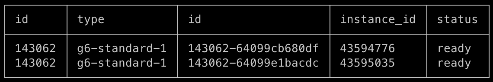
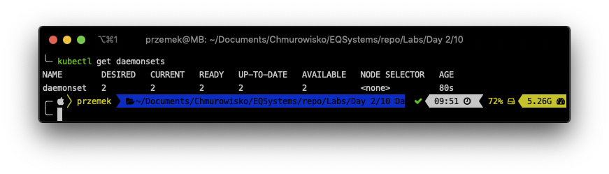
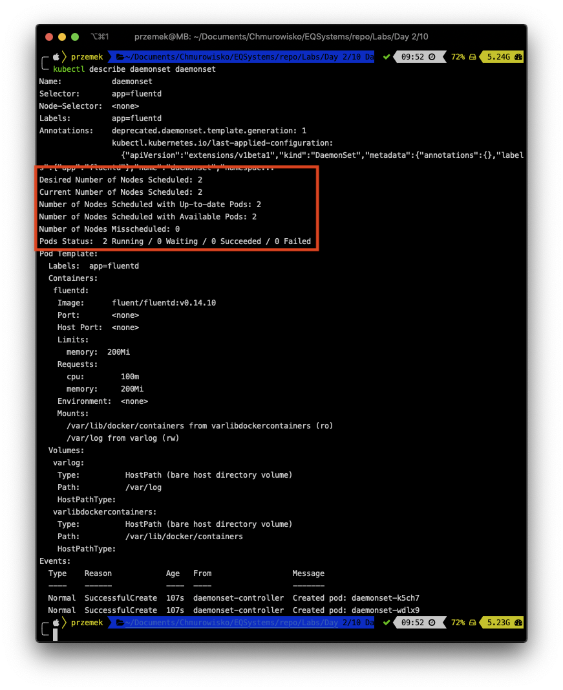
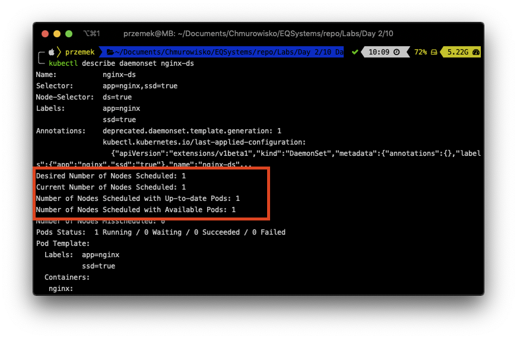
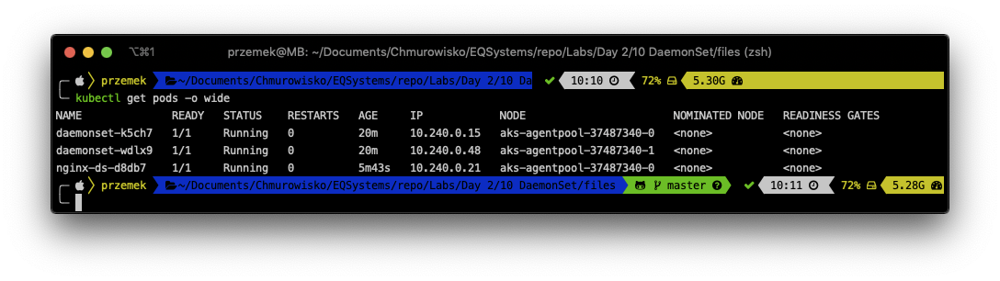

<br><br>
<br><br>
<br><br>

# DaemonSets

## LAB Overview

#### In this lab you will work with DaemonSets

A DaemonSet ensures a copy of a Pod is running across a set of nodes in a Kuber‐ netes cluster. DaemonSets are used to deploy system daemons such as log collectors and monitoring agents, which typically must run on every node.

## Task 1: Scale your Kubernetes cluster

For this lab you need more than one node in your cluster. To scale a cluster, you need the cluster ID and node pools ID.
1. First, using Linode CLI get the clusterID by listing all Kubernetes Clusters:

    ```bash 
    linode-cli lke clusters-list
    ```

    Copy your clusterID.

2. List Node Pools in your Cluster to get ID

    ```bash 
    linode-cli lke pools-list <clusterID>
    ```

    Copy ID of Node Pool that you want to scale in your cluster.

3. Scale your cluster by using the following command:

    ```bash 
    linode-cli lke pool-update <clusterID> <NodePoolID> --count 2
    ```

    Verify that your cluster has scaled correctly:
    
    ```bash 
    linode-cli lke pools-list <clusterID>
    ```

    You should see similiar output:
    

    Also you can check if you have 2 nodes by typing:
    
    ```bash 
    kubectl get nodes
    ```

## Task 2: Creating a DeamonSet

1. Create DeamonSet:

    ```bash
    kubectl apply -f ds.yaml
    ```
2. Get the list of running DaemonSets: 
    
    ```bash
    kubectl get daemonsets
    ```

    

    and describe the DaemonSet: 
    
    ```bash
    kubectl describe daemonset daemonset
    ```

    As you can see the Pods was successfully deployed to all two nodes in our cluster. 
    
    

## Task 3: Limiting DaemonSets to Specific Nodes

1. Get the list of your nodes:
    
    ```bash
    kubectl get nodes
    ```

    and add node labels to one of them:

    ```bash
    kubectl label nodes <-YOUR-NODE-NAME-> ds=true
    ```

2. Create DeamonSet with a node selector 

    ```bash
    kubectl apply -f ds_select.yaml
    ```

3. Describe the daemonset: 

    ```bash
    kubectl describe daemonset nginx-ds
    ```

    
    
    The Pod is now applied to only one of the nodes.

4. Get the list of Pods:


    ```bash
    kubectl get pods -o wide
    ```

    
    You should have two Pods running on one of your nodes and one on the second one.

1. Delete both DaemonSets:

    ```bash
    kubectl delete -f .
    ```

    and rescale your cluster to one node:

    ```bash
    linode-cli lke pool-update <clusterID> <NodePoolID> --count 1
    ```

## END LAB

<br><br>

<center><p>&copy; 2023 Chmurowisko Sp. z o.o.<p></center>
