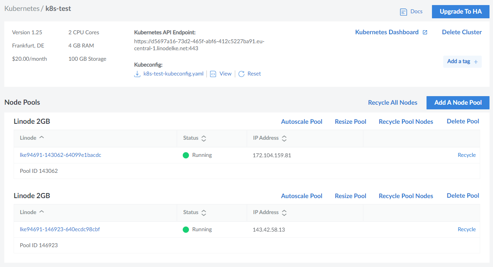
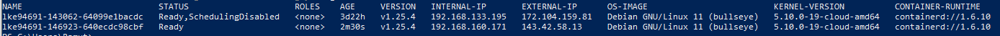

  
  
  

# Move deployments to a new node

## LAB Overview

#### In this lab you will work with moving deployments to a new node

Moving deployments to a new node is a common administration task in Kubernetes. In this lab you will learn how to do it.
Node update should be performed node by node, to avoid downtime of the whole cluster.
Important commands:
* `kubectl drain <node-name>` - move all pods from the node to other nodes (and make the node unschedulable)
* `kubectl uncordon <node-name>` - make the node schedulable again
* `kubectl cordon <node-name>` - make the node unschedulable

## Task 1: Creating a deployment
1. Create new file by typing `nano deployment.yaml`.
1. Download [manifest file](./files/deployment.yaml) and paste its content into editor, save changes by pressing *CTRL+O* and *CTRL-X*.
1. Create a deployment with 3 replicas by running `kubectl apply -f deployment.yaml`
1. Check the deployment by running `kubectl get deployments`

## Task 2: Add a new node to the cluster
1. Open linode cloud and go to the cluster blade and chooose your cluster.
    
    

1. Click on the *Add A Node Pool* button, add a specific configuration and choose the *Add Pool* option.
    
    

1. Wait for the node to be ready.
    
    

## Task 3: Move the deployment to the new node
1. Check the current node configuration by running `kubectl get nodes -o wide`
    
    

1. Make the old node not schedulable `kubectl cordon <node-name>`

1. Check the status of the old node `kubectl get nodes -o wide`
    
    

1. Move all pods from the old node to other nodes `kubectl drain <node-name> --ignore-daemonsets`
    
1. Check the status of deployed pod's `kubectl get pods -o wide`
    
    

1. Make the old node schedulable again `kubectl uncordon <node-name>`

1. Check again the status of the old node `kubectl get nodes -o wide`
    
    

## END LAB

  

&copy; 2023 Chmurowisko Sp. z o.o.

